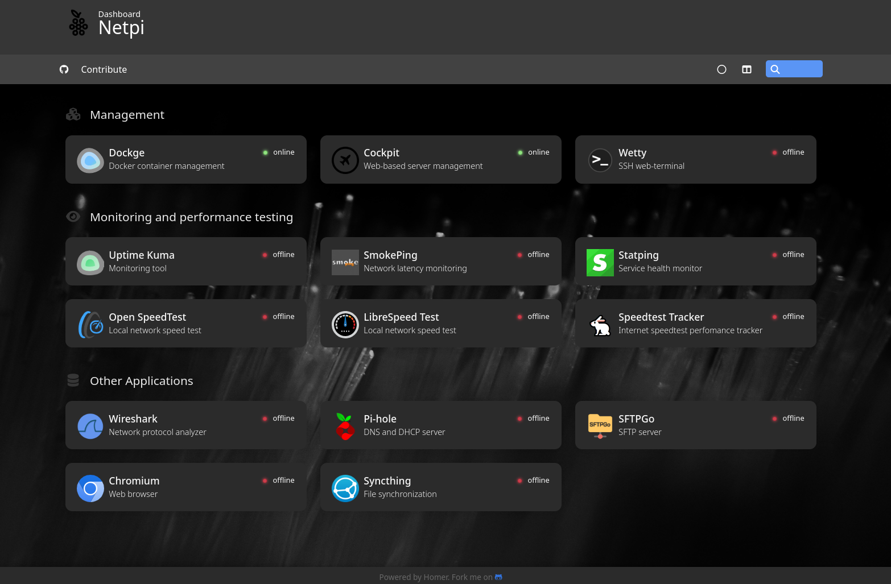

<p align="center"></p>
<h1 align="center">Netpi</h1>
<p align="center"><b>Simplify network diagnostic and troubleshooting with a Raspberry Pi powered toolkit</b></p> 



# Table of Contents

- [Purpose](#purpose)
- [Requirements](#requirements)
- [Installation](#installation)
- [Usage](#usage)
- [Contributing](#contributing)
- [Acknowledgments](#acknowledgments)

# Purpose
Netpi is an Ansible based automation script designed to simplify the installation of essential network troubleshooting tools on Ubuntu Linux hosts. Intended for Raspberry Pi's, Netpi provides a [comprehensive suite](docs/tools.md) of CLI tools and Docker containers, all accessible through a custom dashboard, making network diagnostics and troubleshooting efficient and user-friendly.

# Requirements
The Raspberry Pi served as the inspiration for this project due to its compact form factor and widespread adoption. However, the project can be installed on any host running Ubuntu.
The project has been tested and verified on the following Raspberry Pi model and Ubuntu versions:

Raspberry Pi:
- Raspberry Pi 4 (4 GB RAM version)

Ubuntu:
- Ubuntu Server 22.04 LTS
- Ubuntu Server 24.04 LTS

# Installation
The installation script performs the following actions:

1. Installs Ansible from the official PPA
2. Runs an Ansible playbook locally

The Ansible playbook executes the following tasks:

1. Updates the system packages
2. Installs all necessary CLI tools
3. Installs Docker and Docker Compose
4. Creates systemd scripts that dynamically read and store the IP address of the Host for the dashboard
5. Activates automatic system package updates, if enabled in the configuration
6. Creates a folder for Docker services under /opt
7. Copies all Docker Compose files into the newly created folder

## Configuration
Before running the setup script, review and customize the config.yml file. This file contains essential configuration parameters for the installation process. Adjust the settings according to your personal preferences and requirements.

## Installation Steps
The script must be executed locally on the target host.

1. Clone the Netpi repository to the target host:
```
git clone https://github.com/SG303/netpi.git
```
2. Navigate to the cloned directory:
```
cd netpi
```
3. If needed, change configuration parameter in the config file
```
nano config.yml
```
4. Make the *setup.sh* script executable
```
chmod +x setup.sh
```
5. Run the setup script
```
./setup.sh
```
6. Once the playbook execution is complete, access the Netpi dashboard by navigating to your Raspberry Pi's IP address in a web browser. The dashboard is running on http port 80.


# Usage
The Docker container services can be accessed via the dashboard. By default, only the dashboard and Dockge container are initially started. Dockge is a Docker container management software. Additional containers can be launched either through Dockge or directly via the command-line interface.

The installed CLI tools can be used normally through the host's command line. Additionally, the web-based terminal tool "Wetty," which is accessible from the dashboard, allows direct access to the host's CLI through a web browser.

A list of all the installed tools and containers can be found [here](docs/tools.md).

The Docker containers work out of the box. Depending on the use case, some changes may need to be made to the Docker Compose files.

For instructions on using the individual tools, please refer to their respective project documentation.

# Contributing

Contributions to enhance Nepi's functionality and usability are welcome. To contribute, please follow these steps:
1. Fork the repository
2. Create a new branch for your feature or bug fix
3. Commit your changes and push the branch to your fork
4. Submit a pull request detailing your changes

# Acknowledgments
Thanks go to the open-source community for developing and maintaining [the incredible tools and utilities](docs/tools.md) that make Netpi possible.
